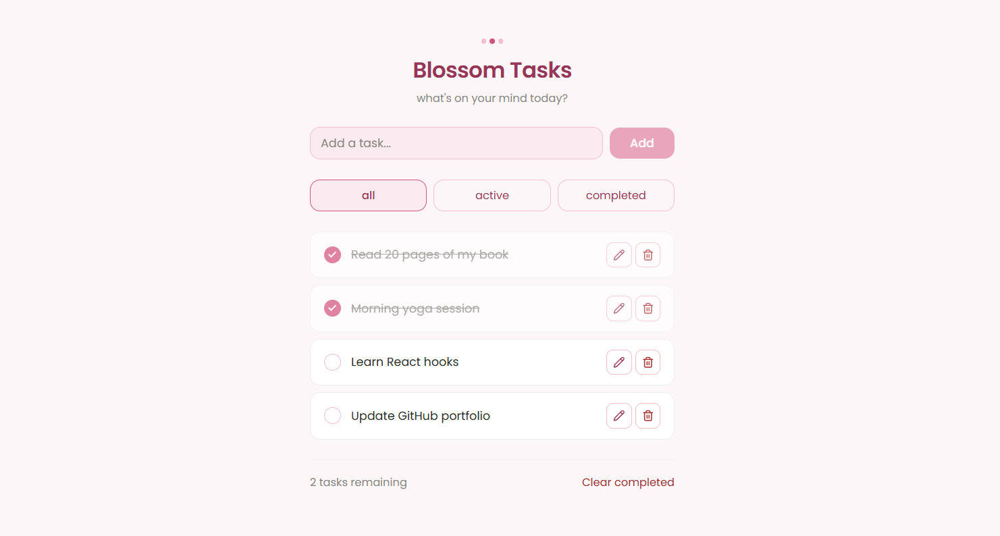

# 🌸 Blossom Tasks

A todo list app built with React and TypeScript — my first React project.


## 📸 Preview



## ✨ Features

- Add, edit, complete and delete tasks
- Filter tasks by status — All, Active, Completed
- Clear all completed tasks at once
- Persistent storage with localStorage
- Accessible — keyboard navigation and screen reader support
- Responsive design

## 🛠️ Tech Stack

- **React 19** — UI library
- **TypeScript** — static typing
- **Vite** — build tool
- **SCSS Modules** — scoped component styles
- **Lucide React** — icons
- **clsx** — conditional class names

## 🚀 Getting Started

### Prerequisites

Make sure you have **Node.js** installed on your machine.
You can download it at [nodejs.org](https://nodejs.org) — download the **LTS** version.

Check your installation:

```bash
node -v
npm -v
```

### Installation

**1. Clone the repository**

```bash
git clone https://github.com/AlizeePe/blossom-tasks.git
```

**2. Navigate to the project folder**

```bash
cd blossom-tasks
```

**3. Install dependencies**

```bash
npm install
```

**4. Start the development server**

```bash
npm run dev
```

**5. Open your browser at**

```
http://localhost:5173
```

---

## 📝 Available Scripts

```bash
npm run dev      # Start development server
npm run build    # Build for production
npm run preview  # Preview production build
```

Made with 🌸 by Alizee
